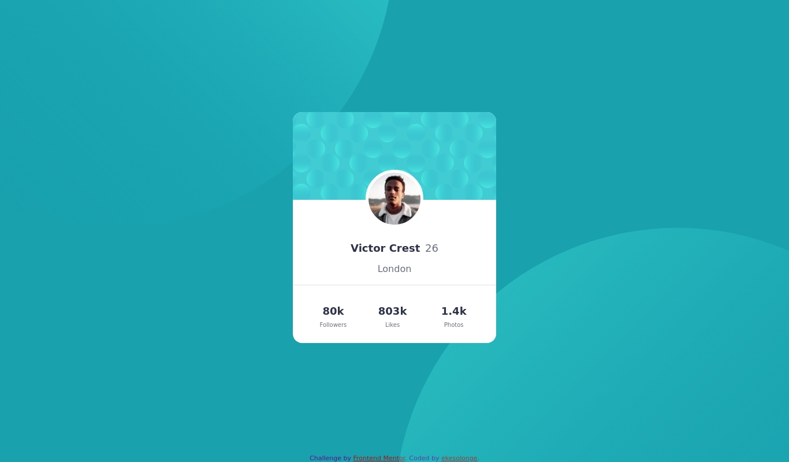

# Frontend Mentor - Profile card component solution

This is a solution to the [Profile card component challenge on Frontend Mentor](https://www.frontendmentor.io/challenges/profile-card-component-cfArpWshJ). Frontend Mentor challenges help you improve your coding skills by building realistic projects.

## Table of contents

- [Overview](#overview)
  - [The challenge](#the-challenge)
  - [Screenshot](#screenshot)
  - [Links](#links)
- [My process](#my-process)
  - [Built with](#built-with)
- [Author](#author)

**Note: Delete this note and update the table of contents based on what sections you keep.**

## Overview

### The challenge

- Build out the project to the designs provided

### Screenshot

### Links

- Solution URL: [https://www.frontendmentor.io/solutions/html-and-css-card-using-flexbox-ldodzSYLX](https://www.frontendmentor.io/solutions/html-and-css-card-using-flexbox-ldodzSYLX)
- Live Site URL: [https://profile-card-component-ekesolonge.netlify.app](https://profile-card-component-ekesolonge.netlify.app)

## My process

### Built with

- Semantic HTML5 markup
- CSS custom properties
- Flexbox

## Author

- Website - [Longe Ekeso](https://ekesolonge-portfolio.netlify.app)
- Frontend Mentor - [@ekesolonge](https://www.frontendmentor.io/profile/ekesolonge)
- Twitter - [@ekesolonge](https://www.twitter.com/ekesolonge)
